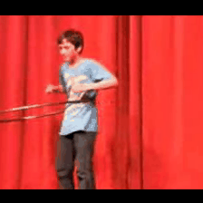

# Video-Action-Classification
Video action classification using Pytorch R3D-18 model

<p align="center">
  
  
  
  
</p>


### Dataset 
You can download UCF-101 dataset from the official source: [UCF101](https://www.crcv.ucf.edu/data/UCF101.php) Dataset. 
### Requirements
- Python 3
- PyTorch 
- NumPy 
- Imageio
- Opencv-python
- 
### Directory Structure
List of video clips for training and testing inside `train.txt`and `test.txt` respectively. 

Video data should be stored inside `.../workplace/UCF101_Train/videos` and `.../workplace/UCF101_Test/videos`.

Note: Provided `train.txt` and `test.txt` files correspond to the official split 1 of the UCF-101 dataset. 

These can be modified to accommodate custom splits for semi-supervised learning experiments. 

Additionally, semi-supervised splits `videossl_10p_ucf_labeled.txt` and `videossl_10p_ucf_unlabeled.txt` following the semi-supervised splits based on [VideoSSL](https://arxiv.org/abs/2003.00197) are provided as examples.


### Checkpoints
The trained models, used to produce the numbers in the paper, can be downloaded here.
### Running

```
python main.py --batch_size 32 --clip_len 16 --crop_size 256 --epochs 50 --lr 0.0001

```
###  Acknowledgements
This code is based on [Rethinking Zero-shot Video Classification](https://github.com/bbrattoli/ZeroShotVideoClassification/) repository
